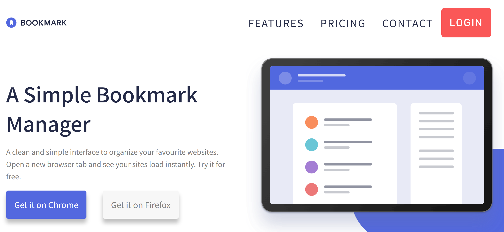
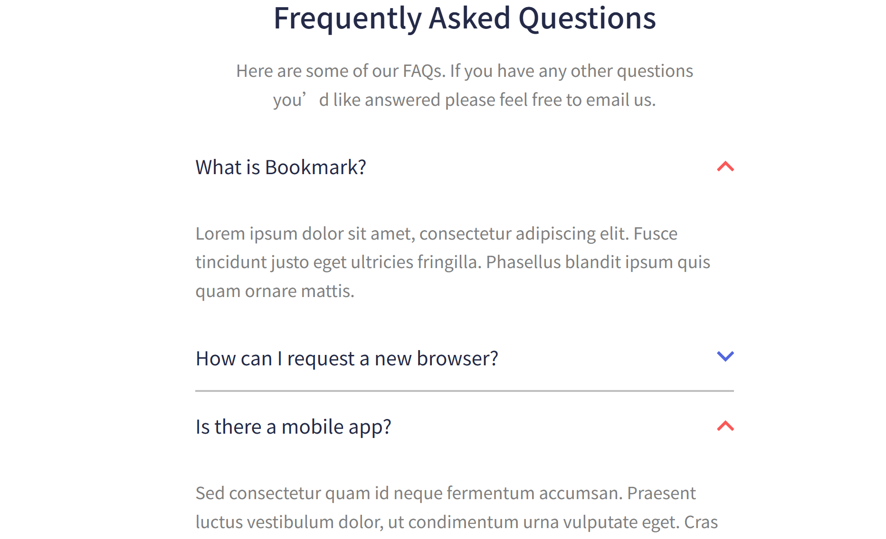
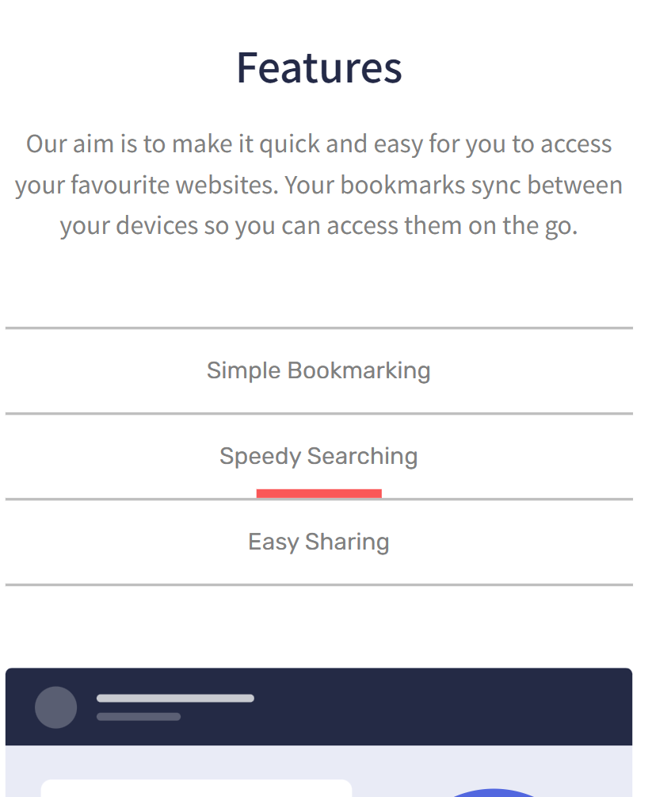
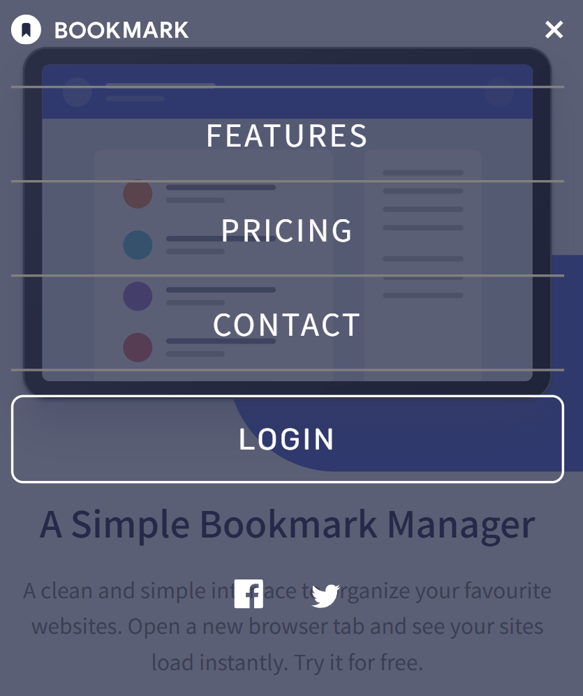
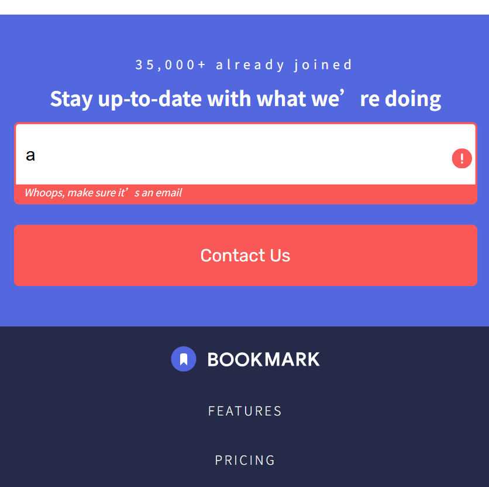

# Frontend Mentor - Bookmark landing page solution

This is a solution to the [Bookmark landing page challenge on Frontend Mentor](https://www.frontendmentor.io/challenges/bookmark-landing-page-5d0b588a9edda32581d29158). Frontend Mentor challenges help you improve your coding skills by building realistic projects. 

## Table of contents

- [Overview](#overview)
  - [The challenge](#the-challenge)
  - [Screenshot](#screenshot)
  - [Links](#links)
- [My process](#my-process)
  - [Built with](#built-with)
  - [What I learned](#what-i-learned)

## Overview

### The challenge

Users should be able to:

- View the optimal layout for the site depending on their device's screen size
- See hover states for all interactive elements on the page
- Receive an error message when the newsletter form is submitted if:
  - The input field is empty
  - The email address is not formatted correctly

### Screenshot








### Links

- Solution URL: [https://github.com/hrong1/bookmark-landing-page](https://github.com/hrong1/bookmark-landing-page)
- Live Site URL: [https://hrong1.github.io/bookmark-landing-page/](https://hrong1.github.io/bookmark-landing-page/)

## My process

### Built with

- Semantic HTML5 markup
- CSS custom properties
- Flexbox
- CSS Grid
- Mobile-first workflow
- [React](https://reactjs.org/) - JS library

### What I learned

Learn using Mixins for my styling

```scss
@mixin logo-style($text-fill: null, $icon-shape-fill: null, $icon-bg-fill: null) {
  @if $text-fill {
    .logo-text{
      fill: $text-fill;
    }
  }

  @if $icon-shape-fill {
    .logo-icon-shape {
      fill: $icon-shape-fill;
    }
  }
  @if $icon-bg-fill {
    .logo-icon-bg {
      fill: $icon-bg-fill;
    }
  }
}
```


